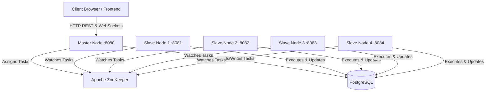

# Distributed Job Scheduler - Project Report

## 1. Problem Statement & Relevance in Distributed Systems
**Problem Statement:**
Modern applications require processing heavy background tasks (such as AI model training, bulk email sending, and batch data processing) without blocking the main application flow. A single-node job scheduler constitutes a single point of failure and suffers from limited throughput. The goal of this project is to build a fault-tolerant, highly available **Distributed Job Scheduler** that distributes workloads across multiple worker nodes, dynamically handles node failures, and guarantees task execution.

**Relevance in Distributed Systems:**
This project embodies core Distributed Systems concepts:
- **Fault Tolerance:** If a worker crashes, its tasks are re-assigned, and if the master crashes, a new master is elected.
- **Concurrency & Scaling:** Multiple worker nodes process different tasks simultaneously.
- **State Synchronization:** ZooKeeper and PostgreSQL are used to synchronize the state of tasks and nodes across the cluster.
- **Transparency:** The client simply submits a task without needing to know which specific underlying worker executed it.

---

## 2. Architecture Design
The architecture consists of a React.js frontend, a Go-based API/Scheduler backend running as a cluster (1 Master, 4 Slaves), an Apache ZooKeeper ensemble for coordination, and a PostgreSQL database for persistent storage.

---

## 3. Distributed Algorithms Selected

The system implements **two** primary distributed algorithms:

### Algorithm 1: Leader Election (via ZooKeeper Ephemeral Sequential Nodes)
- **Purpose:** To ensure exactly one node acts as the "Master" (Scheduler) to prevent split-brain issues where multiple nodes try to assign the same task.
- **How it Works (Chain-Watch Pattern):** 
  1. Every node registers an ephemeral sequential znode under `/workers` (e.g., `worker_00001`, `worker_00002`).
  2. The node with the lowest sequence number automatically becomes the Master.
  3. Instead of every slave watching the Master (which causes a "thundering herd" problem if the master dies), each slave watches its **immediate predecessor**. 
  4. If a node fails, only the node immediately next in sequence is notified, which then checks if it is now the lowest sequence to become the new Master.

### Algorithm 2: Hybrid Task Scheduling (Least-Loaded + Round-Robin)
- **Purpose:** To efficiently distribute pending tasks among available worker nodes.
- **How it Works:**
  1. The Master retrieves a list of all currently active workers from ZooKeeper.
  2. **Least-Loaded Phase:** The master checks the `/assignments` directory in ZooKeeper to count how many tasks each worker currently has. It identifies the worker(s) with the lowest current load.
  3. **Round-Robin Fallback:** If multiple workers have the exact same minimum load (e.g., all have 0 tasks), the algorithm falls back to a Round-Robin approach using a continuously incrementing index counter modulo the number of tied workers. This ensures perfectly even distribution during traffic spikes.

---

## 4. Implementation Details
- **Multi-Node Deployment:** The application spins up **5 separate backend processes** (1 Master, 4 Slaves) that bind to `0.0.0.0` over different network ports (8080-8084). 
- **Network Configuration:** It automatically detects the host's Local IP (e.g., Wi-Fi Hotspot) and exposes the endpoints so that other physical machines (phones, other laptops) on the same network can access the cluster and submit tasks. This satisfies the strict multi-machine interaction requirement.

---

## 5. Use Cases Demonstrated
The system demonstrates **three distinct use cases** for task scheduling:

1. **Batch Processing (`batch_processing`)**
   - **Description:** Simulates the processing of large datasets or report generation.
   - **Action:** Distributes heavy data-crunching workloads across available nodes to reduce overall processing time.
2. **Email Notification (`email_notification`)**
   - **Description:** Simulates triggering bulk emails or transactional notifications asynchronously.
   - **Action:** Queues email requests with priority levels, ensuring that critical notifications are processed ahead of standard newsletters by the worker pool.
3. **AI Job Processing (`ai_job`)**
   - **Description:** Simulates passing prompts/data to heavy Machine Learning inference models.
   - **Action:** Offloads CPU/GPU-intensive tasks to the background workers so the main frontend layer remains highly responsive and non-blocking for user requests.
